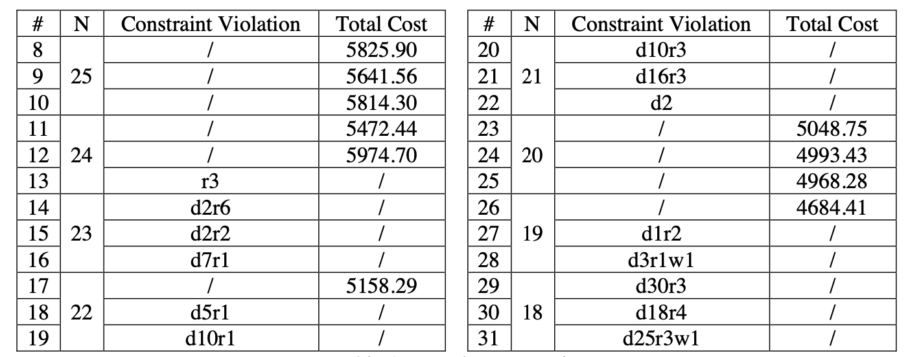

# Stnet-Star-Shuttle-Opt

Code for paper: Spatio-Temporal Network for Star-shaped Shuttle Bus Scheduling Optimization

## Code

- `NYUSH_solution.py` specifies the evolution_depth and terminates as soon as it reaches the evolution_depth, no matter if a feasible solution is found or not.

- `NYUSH_solution_mutation_type.py` is the code for comparing the 2 mutation methods: conventional method vs new method (similar to `NYUSH_solution.py`).

- `NYUSH_solution_no_violation.py` automatically reruns itself when a feasible solution is unfound after a certain number of iteration. If the program ends naturally, there is a feasible solution. If not, it may loop forever (WARNING).

- `NYUSH_solution_no_violation_hpc.py` and `NYUSH_solution_no_violation_hpc.sh` are scripts for HPC. There are not many changes in these two.

- `test_results` has all the output (txt + png) classified in different folders.

## Experiment Results

d2r6 is a shorthand for 2 violations of the demand constraint and 6 violations of the rush hour constraint. If there were, for example, 2 violations of the maximum working hour constraint, it would be denoted as w2.

## Notes

Repo adapted from [DURF-Bus-Schedule-Optimization](https://github.com/AlisonYao/DURF-Bus-Schedule-Optimization).
